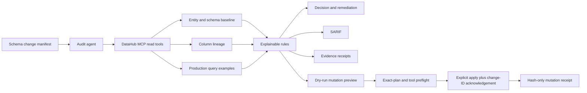

# Architecture

LineageProof separates context collection, evidence normalization, deterministic rules, and explicitly authorized metadata mutation. The design keeps the default demo useful without pretending that synthetic metadata is production proof.

## Components

### Audit manifest

The input declares one DataHub dataset URN, a stable change identifier, an evidence timestamp, and one or more field-level changes. Each change records the exact before and after state plus a rationale. Invalid or incomplete manifests fail before any MCP call.

### Tool session

`FixtureToolSession` and `StdioMcpToolSession` expose the same asynchronous `call_tool` contract. The fixture provider matches only synthetic responses. The stdio provider connects to the official DataHub MCP server through the MCP Python SDK.

The session records only:

- tool name;
- non-secret arguments;
- sequence number; and
- SHA-256 hash of the canonical response.

Raw DataHub responses are used in memory for the audit but are not copied into the receipt file.

### Baseline gate

Before impact analysis, LineageProof verifies that:

- the dataset has an owner in the retrieved entity response;
- every proposed source field exists in the current schema; and
- the proposed source type and nullability match DataHub.

A stale baseline is critical because downstream conclusions would otherwise be attached to the wrong schema state.

### Field rules

The current rules evaluate:

- a rename or removal that reaches downstream assets;
- incompatible or contract-sensitive type changes;
- nullability relaxation used in aggregations or other sensitive SQL operations;
- PII fields whose downstream assets lack matching classification; and
- missing dataset ownership.

Every issue links back to the exact tool receipt numbers used for the decision.

### Decision

- Any critical or high issue: `request_remediation`
- Medium issues only: `approve_with_conditions`
- No issues: `approve`

This is an explicit rule contract rather than an opaque risk score.

### Write-back gate

The audit command only prepares official DataHub MCP mutation calls. The preview states `dry_run: true` and `mutation_tools_invoked: false`. A separate write-back command then rejects any plan that does not exactly match the supplied audit-report hash and deterministic call set, rejects unavailable or non-allowlisted mutation tools, and caps execution at 100 calls.

Execution requires both `--apply` and an acknowledgement exactly equal to `APPLY <change_id>`. The resulting receipt stores arguments and response hashes, not raw responses. A synthetic receipt records `external_metadata_modified: false`; a live receipt keeps external state `unverified` until a separate read-back proves it.

## Extension points

- Add rule modules without changing the provider contract.
- Add an HTTP MCP transport alongside stdio.
- Add organization-specific contract rules loaded from a versioned policy file.
- Add post-mutation read-back verification for tags and column descriptions.
- Attach the SARIF report to pull-request checks.

## Current truth boundary

The read fixture proves deterministic audit orchestration and rules. The separate write-back fixture proves that the authorization gate invokes the five expected mutation calls and emits privacy-safe receipts while modifying no external metadata. Neither fixture proves access to a production DataHub instance, completeness of production lineage, or a live metadata change.
